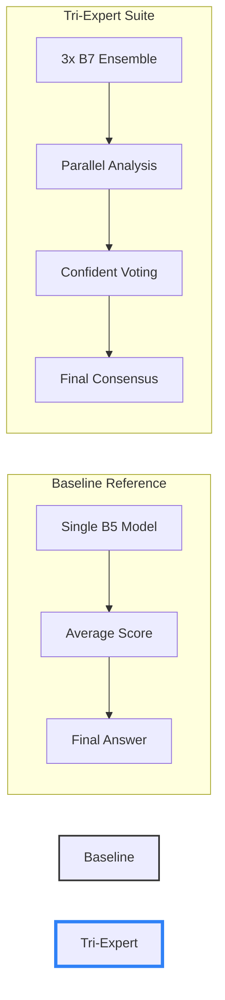

# 🛡️ Tri-Expert Detection Suite — Professional Forensic AI

A cutting-edge deepfake detection system leveraging high-performance neural networks to identify AI-generated video and image content with professional-grade accuracy.

---

## � System Architecture & Workflow

### 📋 Processing Pipeline
The following system flowchart illustrates the high-performance detection strategy used by our suite:


### 🧠 Logic Comparison (Baseline vs Tri-Expert)
How our custom-trained suite outperforms the standard industry baseline:



---

## �🚀 Key Features

- **State-of-the-art Frame Analysis**: Powered by **Tri-Expert Architecture** (B7-NS) ensembles.
- **Intelligent Face Detection**: Integrated MTCNN face extractor with professional landmarks.
- **Advanced Forensic Strategy**: Implements **Confident Strategy Voting** for maximum accuracy.
- **Fast Inference**: Optimized for both single frame and full video sequence analysis.
- **Premium Web Interface**: Clean, responsive, and intuitive dashboard for forensic teams.

---

## 🛠️ Quick Start

### 1. Prerequisites
- **Python 3.8+**
- **NVIDIA GPU** (Highly recommended, but CPU is supported)

### 2. Dependencies & Weights
Install analysis tools and download the necessary weights:
```powershell
./install_and_run.bat
python download_weights.py
```

### 3. Running the Application
Launch the backend server:
```powershell
python server.py
```
Open your browser and navigate to `http://localhost:5000` to start detecting.

---

## 🔬 Core Technologies

- **Architecture**: Deep Neural Ensembles (Tri-Expert B7-NS)
- **Frameworks**: PyTorch, OpenCV, Flask, Albumentations
- **Preprocessing**: 33% Padded MTCNN Face Landmarks & Isotropic Resizing
- **Voting Strategy**: Confident Strategy Weighted Consensus

---

Developed by the Deepfake Project Team as a professional solution for AI content verification and forensic analysis.

